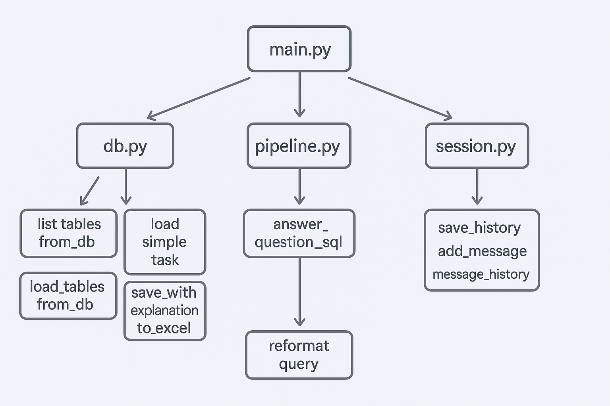

# Hybrid SQL Assistant

Интерактивный ассистент для SQL-аналитики и обработки табличных данных на основе LLM (Mistral API).

## Возможности

- 📥 **Загрузка данных** — Excel/CSV в SQLite-базу
- 📊 **Выбор таблиц** — интерактивный выбор таблиц для анализа
- 💬 **Естественный язык** — запросы на русском языке
- 🔄 **Переформулирование** — автоматическая оптимизация запросов через LLM
- ⚡ **Гибридная логика** — часть операций выполняется локально без LLM
- 💾 **Экспорт** — сохранение результатов в `.xlsx`
- 📝 **История** — ведение истории сеанса

## Требования

- Python 3.8+
- API ключ Mistral (бесплатно на [console.mistral.ai](https://console.mistral.ai/))

## Установка

```bash
# Клонирование репозитория
git clone https://github.com/SdvSeven/Exel-Automatic.git
cd Exel-Automatic

# Установка зависимостей
pip install -r requirements.txt
```

## Настройка

1. Скопируйте файл настроек:
```bash
copy env.example .env
```

2. Откройте `.env` и добавьте ваш API ключ:
```
MISTRAL_API_KEY=ваш_ключ_здесь
MISTRAL_MODEL=mistral-tiny
```

## Использование

### Импорт данных

```bash
python -m src.agents.importer
```

Введите путь к Excel или CSV файлу. Данные будут загружены в SQLite базу.

### Запуск анализа

```bash
python -m src.main
```

1. Выберите таблицу(ы) из списка
2. Задавайте вопросы на естественном языке
3. Получайте результаты в виде SQL-запросов и ответов

### Примеры запросов

- "Сколько строк в таблице?"
- "Покажи первые 10 записей"
- "Какие уникальные значения в столбце X?"
- "Отсортируй по дате"

## Структура проекта

```
Exel-Automatic/
├── src/
│   ├── main.py                 # Точка входа приложения
│   ├── core/
│   │   ├── __init__.py
│   │   ├── config.py          # Конфигурация (API ключи)
│   │   ├── database.py        # Работа с SQLite
│   │   └── pipeline.py        # Обработка данных и Excel
│   ├── agents/
│   │   ├── __init__.py
│   │   ├── sql_agent.py       # Генерация SQL-запросов
│   │   └── importer.py         # Импорт файлов в БД
│   └── utils/
│       ├── __init__.py
│       └── session.py         # Управление сессией
├── tests/                     # Тесты (заготовка)
├── docs/                      # Документация
├── image/                     # Изображения
├── env.example                # Шаблон переменных окружения
├── requirements.txt           # Зависимости Python
├── setup.py                   # Установщик
└── README.md                  # Этот файл
```

## Архитектура

```
┌─────────────────────────────────────────────────────────────┐
│                        CLI (main.py)                        │
└─────────────────────────────────────────────────────────────┘
                              │
        ┌─────────────────────┼─────────────────────┐
        ▼                     ▼                     ▼
┌───────────────┐    ┌───────────────┐    ┌───────────────┐
│    agents/    │    │    core/     │    │    utils/     │
│               │    │               │    │               │
│ sql_agent.py  │    │ database.py   │    │ session.py    │
│ importer.py   │    │ pipeline.py   │    │               │
│               │    │ config.py    │    │               │
└───────────────┘    └───────────────┘    └───────────────┘
        │                     │                     │
        └─────────────────────┼─────────────────────┘
                              ▼
                    ┌─────────────────┐
                    │   Mistral API  │
                    └─────────────────┘
```

## Гибридные команды

Часть операций выполняется локально без обращения к LLM:

| Команда | Описание |
|---------|----------|
| `удали дубликаты` | Удалить дубликаты |
| `первые 50 строк` | Оставить первые N строк |
| `последние 20 строк` | Оставить последние N строк |
| `очисти пропуски` | Удалить строки с пустыми значениями |
| `сортируй по [столбец]` | Сортировка по столбцу |
| `размер таблицы` | Показать количество строк/столбцов |

## Безопасность

🔒 **Важно**: Никогда не публикуйте ваш API ключ в репозитории!

- Ключи хранятся в файле `.env`
- Файл `.env` добавлен в `.gitignore`
- Все секреты загружаются из переменных окружения

## Лицензия

MIT License

---

Co-authored-by: SdvSeven <ssdvseven@gmail.com>
