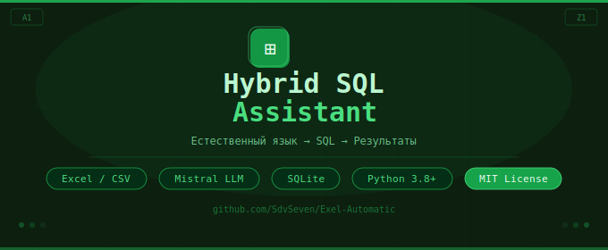

<div align="center">
  
</div>
<div align="center">

**Интерактивный ассистент для SQL-аналитики и обработки табличных данных на основе LLM**

[](https://python.org)
[](https://console.mistral.ai)
[](https://sqlite.org)
[](LICENSE)

</div>


---

## 📗 Содержание

- [Возможности](#-возможности)
- [Архитектура](#-архитектура)
- [Требования](#-требования)
- [Установка](#-установка)
- [Настройка](#-настройка)
- [Использование](#-использование)
- [Гибридные команды](#-гибридные-команды)
- [Структура проекта](#-структура-проекта)
- [Безопасность](#-безопасность)

---

## 📗 Возможности

| | Функция | Описание |
|---|---|---|
| 🟢 | **Загрузка данных** | Excel / CSV → SQLite автоматически |
| 🟢 | **Выбор таблиц** | Интерактивный выбор для анализа |
| 🟢 | **Естественный язык** | Запросы на русском, без SQL вручную |
| 🟢 | **Переформулирование** | Автооптимизация запросов через LLM |
| 🟢 | **Гибридная логика** | Часть операций — локально, без API |
| 🟢 | **Экспорт** | Сохранение результатов в `.xlsx` |
| 🟢 | **История** | Ведение истории сеанса |

---

## 📗 Архитектура

```
┌─────────────┐     ┌──────────────┐     ┌─────────────┐
│  Excel/CSV  │────▶│  reformat.py │────▶│  SQLite DB  │
└─────────────┘     └──────────────┘     └──────┬──────┘
                                                 │
                    ┌──────────────┐             │
                    │   main.py    │◀────────────┘
                    └──────┬───────┘
                           │
              ┌────────────┴────────────┐
              │                         │
    ┌─────────▼──────┐       ┌──────────▼──────┐
    │  Гибридные     │       │   sql_agent.py  │
    │  команды       │       │  (Mistral LLM)  │
    │  (локально)    │       └──────────┬───────┘
    └────────┬───────┘                  │
             │                          │
             └───────────┬──────────────┘
                         │
                ┌────────▼────────┐
                │  Результат /    │
                │  Export .xlsx   │
                └─────────────────┘
```

---

## 📗 Требования

- **Python** 3.8+
- **Mistral API ключ** — бесплатно на [console.mistral.ai](https://console.mistral.ai/)
- Библиотеки: `pandas`, `openpyxl`, `requests`

---

## 📗 Установка

```bash
# 1. Клонирование репозитория
git clone https://github.com/SdvSeven/Exel-Automatic.git
cd Exel-Automatic

# 2. Установка зависимостей
pip install pandas openpyxl requests
```

---

## 📗 Настройка

**Шаг 1.** Скопируйте шаблон настроек:
```bash
copy .env.example .env
```

**Шаг 2.** Откройте `.env` и вставьте ваш API ключ:
```env
MISTRAL_API_KEY=ваш_ключ_здесь
MISTRAL_MODEL=mistral-tiny
```

> 🔑 Получить бесплатный ключ: [console.mistral.ai](https://console.mistral.ai/)

---

## 🖥 Использование

### Импорт данных

```bash
python reformat.py
```
Введите путь к Excel или CSV файлу — данные загрузятся в SQLite базу.

### Запуск анализа

```bash
python main.py
```

1. Выберите таблицу(ы) из списка
2. Задавайте вопросы на **естественном языке**
3. Получайте результаты в виде SQL-запросов и ответов

### 📗 Примеры запросов

```
> Сколько строк в таблице?
> Покажи первые 10 записей
> Какие уникальные значения в столбце X?
> Отсортируй по дате
> Посчитай сумму по группам
> Найди записи, где значение больше 100
```

---

## 📗 Гибридные команды

Часть операций выполняется **локально**, без обращения к LLM — быстро и без затрат API:

| Команда | Описание |
|---------|----------|
| `удали дубликаты` | Удалить дублирующиеся строки |
| `первые 50 строк` | Оставить первые N строк |
| `последние 20 строк` | Оставить последние N строк |
| `очисти пропуски` | Удалить строки с пустыми значениями |
| `сортируй по [столбец]` | Сортировка по указанному столбцу |
| `размер таблицы` | Показать количество строк / столбцов |

---

## 📗 Структура проекта

```
Exel-Automatic/
├── 📄 main.py          # Основной модуль запуска
├── 📄 db.py            # Работа с SQLite и файлами
├── 📄 reformat.py      # Импорт файлов в базу
├── 📄 sql_agent.py     # Генерация SQL-запросов (LLM)
├── 📄 pipeline.py      # Обработка и сохранение Excel
├── 📄 session.py       # Управление историей сеанса
├── 📄 config.py        # Конфигурация
├── 📄 .env.example     # Шаблон переменных окружения
└── 📁 image/           # Изображения для README
```

---

## 📗 Безопасность

> ⚠️ **Никогда не публикуйте API ключ в репозитории!**

- Ключи хранятся в файле `.env`
- Файл `.env` добавлен в `.gitignore`
- Все секреты загружаются из переменных окружения
- Используйте `.env.example` как шаблон без реальных значений

---

<div align="center">

**Hybrid SQL Assistant** · MIT License · [SdvSeven](https://github.com/SdvSeven)

</div>
